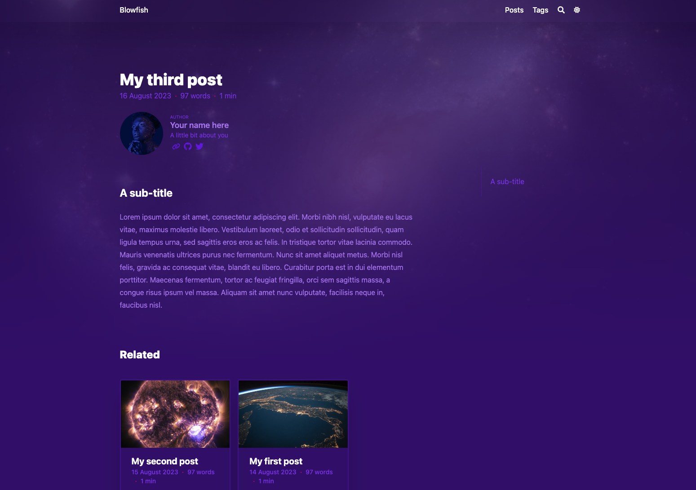
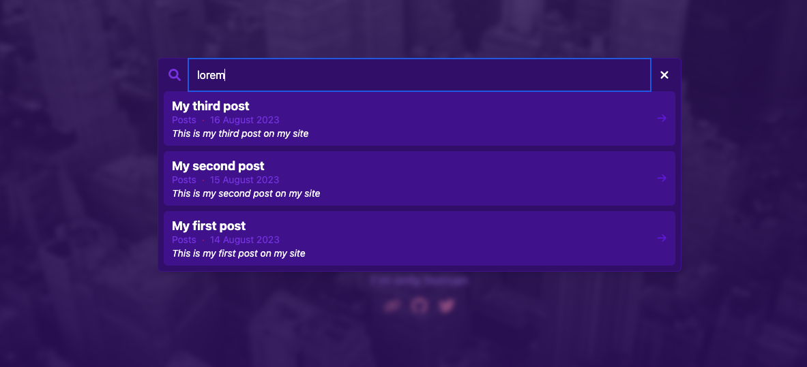
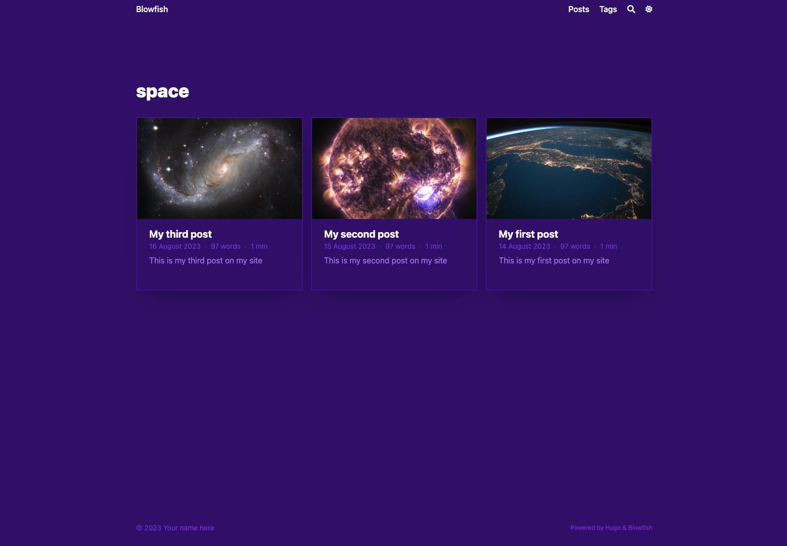

hugo是基于 go 语言的静态网站生成器


## 准备环境

1. 安装 hugo [下载地址](https://github.com/gohugoio/hugo/releases)
2. 安装 golang 环境 [golang下载地址](https://golang.google.cn/dl/)
3. 安装 git 

> 需要配置到环境变量里面
>
> 验证方法 ```hugo version```、```go version```  输出版本信息代表安装成功


## 创建站点

如果环境已经配置好，那么接下来会非常容易，首先创建一个空的 Hugo 网站（没有任何主题），这条命令会在当前目录下创建一个名为MyName的文件夹，里面有 hugo 简单的配置

~~~bash
hugo new site MyName
~~~

安装完之后运行下面的命令，并打开浏览器输入 *[https://localhost:1313](https://localhost:1313/)*  即可查看你的网站。

emmmmm...，好像404了，没关系，这是预期之内的，因为创建了一个空白的网站，Hugo 不会添加任何默认的页面——换句话说，你的网站还没有任何页面可以显示。

下一步，让我门使用 `git submodules` 来安装 Blowfish。通过 `git submodules` 安装可以让以后管理和升级 Blowfish 主题更加方便。

~~~shell
git submodule add -b main https://github.com/nunocoracao/blowfish.git themes/blowfish
~~~

如果这一步执行失败，那么还有备用方案，打开链接将压缩包下载到 MyName/themes 文件夹中，解压缩之后**重命名**为 blowfish

在你的代码根目录下创建 `config/_default/` 文件夹，然后下载[这些文件](https://github.com/nunocoracao/blowfish/releases/latest/download/config-default.zip)，你的目录接下来看起来应该是这样的。

### 换成中文显示

将根目录下的 themes\blowfish\exampleSite\config\_default\languages.zh-cn.toml 和 themes\blowfish\exampleSite\config\_default\menus.zh-cn.toml 复制到config/default 文件中，

然后将扩展名为带有 en 的文件删除，

再创建一个新的文件 config.md

之后你的目录看起来应该是这样的。

```bash
config/_default/
├─ languages.zh-cn.toml
├─ markup.toml
├─ menus.zh-cn.toml
└─ params.toml
```

接下来在 config.md 文件中加入以下代码

~~~bash
hasCJKLanguage = true
~~~


接下来修改 MyName/hugo.toml 文件，添加一下代码，如果有相同的属性，则修改

~~~toml
theme = "blowfish"
languageCode = 'zh-cn'
~~~


目前为止你已经准备好了。再次尝试运行网站，并打开浏览器在 *https://localhost:1313*  查看效果。

~~~bash
hugo server -D
~~~

## 配置主题

很好，如果显示成功，那么我们可以开始配置主题了

> **仅供参考** 本指南不会详细介绍 Blowfish 中的所有特性和参数——如果想要了解所有的功能特性和参数，以及如何使用它们，请参考[Blowfish 文档](https://blowfish.page/docs/configuration/#theme-parameters)。

### menus.en.tom

这个文件定义了你的顶部（banner）和底部（footer）的菜单结构。对于本指南，我们只使用菜单的这两部分：*Posts* 和 *Tags*。

- **Posts** - 用于展示网站中的所有内容条目的完整列表
- **Tags** - 自动生成每篇文章的标签

为了实现这一点，请确保 **menus.en.toml** 文件中设置了以下参数。完成修改后，重新运行**hugo server**，你将会看到顶部菜单。

```toml
[[main]]  #头部
  name = "Posts" #显示的名称
  pageRef = "posts" #链接
  weight = 10 #权重 ，用来控制第几个显示

[[main]]
  name = "Tags"
  pageRef = "tags"
  weight = 30
  
[[footer]] #底部
  name = "标签"
  pageRef = "tags"
  weight = 10
```

pageRef 指向的是 contene 文件下的目录 需要保证下有一个 *_index.md* 文件。

### languages.zh-cn.tom

这个文件配置了网站作者的详细信息。修改下面的内容来定义你自己的信息。

```bash
[author]
   name = "名字在这"
   image = "profile.jpg"
   headline = "我是个好人"
   bio = "关于我的二三事" # 出现在每篇文章的作者卡片中
```

现在可以将一张你的个人图片添加到根目录的 *assets* 文件夹，并命名为 *profile.jpg*。 你可以修改这个文件名，确保文件名和上面个人信息中 `image` 的参数值对应就行。

> 最后一步是配置你的链接——社交媒体、GitHub 等等。该文件包含了所有支持的链接选项，不过他们被注释掉了。你可以将你希望展示的个人链接的配置项接触注释，也可以替换他们的展示顺序。

### params.toml[#](https://blowfish.page/zh-cn/guides/202310-blowfish-tutorial/#paramstoml)

这个文件是 Blowfish 的配置文件。大部分的视觉选项或自定义的选项可以通过它进行配置，它涵盖了 Blowfish 主题的多个功能特性。 对于本指南，我决定使用 **background** 布局，你也可以[查看Blowfish主题其他的主页布局](https://blowfish.page/)；同时使用了 **Neon** 颜色方案，你可以查看[完整的颜色方案列表](https://blowfish.page/docs/getting-started/#colour-schemes)或者[创建自己的颜色方案](https://blowfish.page/docs/advanced-customisation/#colour-schemes)。

将 **image.jpg** 文件添加到 assets 文件夹，它将会作为网站的背景。你可以挑选自己喜欢的，当然也可以用本指南中使用的这张图。


现在让我们打开 *params.toml* 并开始配置。在这里我只会关注需要修改的值，不要再没看文档的情况下，删除此文件的其余部分。

首先让我们确保上面提到的正确的颜色方案，开启图片优化，并设置默认背景图片。

```bash
colorScheme = "neon"
disableImageOptimization = false
defaultBackgroundImage = "image.jpg" # used as default for background images 
```


接下来，让我们配置首页。我们选择了 *background* 布局，配置首页图片和最近文章。此外，可以使用 **card view** 卡片展示的方式来展现最新文章。最后让我们配置头部固定。

```bash
[homepage]
  layout = "background" # valid options: page, profile, hero, card, background, custom
  homepageImage = "image.jpg" # used in: hero, and card
  showRecent = true
  showRecentItems = 6
  showMoreLink = true
  showMoreLinkDest = "/posts/"
  cardView = true
  cardViewScreenWidth = false
  layoutBackgroundBlur = true # only used when layout equals background

[header]
  layout = "fixed"
```

现在配置文章和列表页面的展示。下面是他们的配置。

```bash
[article]
  showHero = true
  heroStyle = "background" 
  showSummary = true
  showTableOfContents = true
  showRelatedContent = true
  relatedContentLimit = 3

[list]
  showCards = true
  groupByYear = false
  cardView = true
```

如果你再次运行**hugo server**，你会看到类似下面这张图的效果。 


## 在你的网站中添加内容[#](https://blowfish.page/zh-cn/guides/202310-blowfish-tutorial/#在你的网站中添加内容)

创建一个文件夹`/content/posts`，在这个文件夹下添加你的帖子或文章。这也是你在菜单所配置的所有文章的根目录。在这个文件夹内，让我们创建一个新目录并命名为 **myfirstpost**。在这个目录中创建一个**index.md**文件作为你的文章，同样也在这个目录中添加**featured.jpg**或**featured.png**作为文章的缩略图。 参考下面这个示例。文件中的前几行是扉页参数（Front Matter），它定义了 Hugo 如何展示文章，更多的参数可以参考[这里](https://blowfish.page/docs/front-matter/)。

```md
---
title: "我的第一篇帖子"
date: 2023-08-14
draft: false
summary: "这是网站的第一篇你帖子"
tags: ["space"]
---

## 一个副标题

Lorem ipsum dolor sit amet, consectetur adipiscing elit. Morbi nibh nisl, vulputate eu lacus vitae, maximus molestie libero. Vestibulum laoreet, odio et sollicitudin sollicitudin, quam ligula tempus urna, sed sagittis eros eros ac felis. In tristique tortor vitae lacinia commodo. Mauris venenatis ultrices purus nec fermentum. Nunc sit amet aliquet metus. Morbi nisl felis, gravida ac consequat vitae, blandit eu libero. Curabitur porta est in dui elementum porttitor. Maecenas fermentum, tortor ac feugiat fringilla, orci sem sagittis massa, a congue risus ipsum vel massa. Aliquam sit amet nunc vulputate, facilisis neque in, faucibus nisl.
```

你可以创建其他文章，来查看和验证站点的效果。你的网站应该像下面的图片一样。 主页显示最近的文章，每篇文章通过相关部分自动关联其他文章，有标签聚合和全文搜索。




  
  
  
  





现在网站已经完成差不多了

