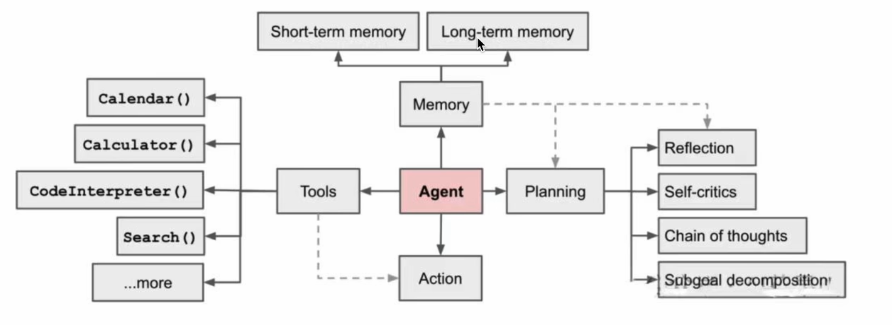
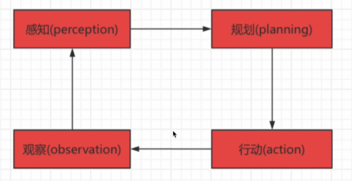
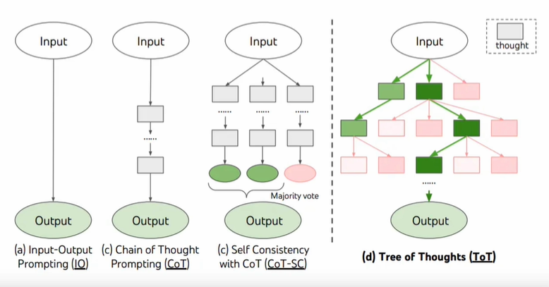
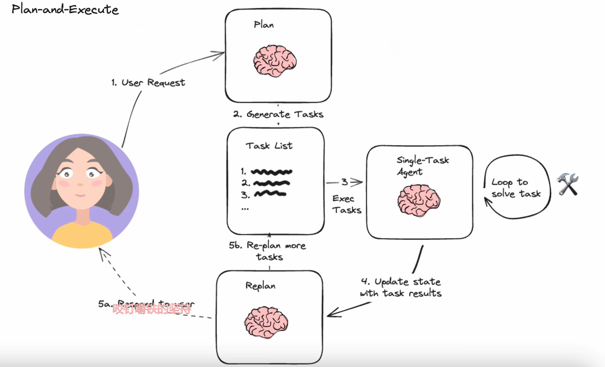

## 基本概念

**机器学习**
分为监督学习、无监督学习、强化学习

下面以教孩子区分不同的水果为例

- 监督学习  
  类似手把手教，告诉机器第一步干什么，第二步干什么。  
  告诉孩子这是苹果，形状是圆的，颜色是红色或者绿色，孩子就会根据圆的红的，推断出这个东西是苹果。
- 无监督学习  
  让孩子观察一堆水果，没有直接告诉他每一个水果的名称，而是鼓励他自己找出如何根据形状，颜色等属性将这些水果分组的方法。  
  一般没有预设的类别标识，通过机器自动学习数据的分布并将相似的数据对象归为同类（如红色圆形是苹果）
- 强化学习  
  每次展示一个水果让他进行判断。如果他判断正确，就给他一个奖励(比如一块糖果);如果判断错误，则不给奖励。通过反复尝试和反馈，孩子会通过这种奖励机制逐渐学习到如何更准确地判断苹果和香蕉。这种学习过程中的关键在于孩子需要在探索新的判断方法和利用已有经验之间找到平衡，以最大化获得奖励的次数。

**深度学习**

试图模拟人类大脑的工作方式，自动提取出数据的高层次特征和模式。
按照架构不同，神经网络可以分为：卷积神经网络（CNNs）、循环神经网络（RNNS）、Transformer网络等等。  
*只需要指出那些是苹果，那些是香蕉，自动从复杂的视觉、嗅觉等信号中提取层次化的特征*

## 大模型训练

**大模型训练分为三个阶段：**

1. 预训练：相当于监督学习，主要是训练一些通用能力。
2. SET 监督微调：指定一个特定领域，进行特定的微调。
3. RLHF 基于人类反馈的强化学习：

**大模型按应用场景分为**

- 大语言模型（LLM）  
  这类大模型专注于自然语言处理(NLP)，通常基于深度学习架构(如Transformer模型)，经过大规模文本数据集训练而成，能够捕捉语言的复杂性，包括语法、语义、语境以及蕴含的文化和社会知识。
- 多模态模型（处理音视频）
  多模态大模型能够同时处理和理解来自不同感知通道(如文本、图像、音频、视频等)的数据，并在这些模态之间建立关联和交互。它们能够整合不同类型的输入信息，进行跨模态推理、生成和理解任务。多模态大模型的应用涵盖视觉问答、图像描述生成、跨模态检索、多媒体内容理解等领域。

## 大模型的工作流程

### 分词化与词表映射

将段落和句子分割成跟小的分词（token）的过程，比如以下句子

~~~
I want to study ACA.
~~~

使用分词化将会得到以下结果

~~~
['I','want','to','study','ACA','.']
~~~

独立的部分可以帮助计算机理解句子的每个部分，以及上下文作用，分词话由不同的粒度分类

1. 词粒度（Word-Level Tokenization）：如上文举得例子，适用于大多数西方语言。
2. 字符粒度（Character-Level）：以单个汉字为单位进行分词化，适用于中文。
3. 字词粒度（Subword-Level）：将单词分解成更小的单位，比如词根词缀等、用于处理新词（比如专有名词、网络用语等）

每一个 token 都会通过预先设置好的词表、映射为一个 token id，一句话最终会被表示为一个元素为 token id 的列表，供计算机进行下一步处理。

大模型进行推理时，它会基于现有的token，根据概率最大原则预测出下一个最有可能的token，然后将该预测的token加入到输入序列中，并将更新后的输入序列继续输入大模型预测下一个token，这个过程叫做自回归。直到输出特殊token(如 <EOS\>，end ofsentence，专门用来控制推理何时结束)或输出长度达到阈值。

## Agents

基于LLM的能够自主理解、自主规划决策、执行复杂任务的智能体。

### 流程图
 

  


- **规期(Planning)**: 把大任务**分解为子任务**，并规划执行任务的流程;并对任务执行过程**思考和反思**，决定任务是否终止或完成。
- **记忆(Memory)**: 短期记忆，是指在执行任务的过程中的上下文，会在子任务的执行过程产生和暂存，在任务完结后被清空。长期记忆是长时间保留的信息，一般是指外部知识库，通常用向量数据库来存储和检索。
- **工具使用(Tools)**: 为智能体配备工具 API，比如:计算器、搜索工具、代码执行器、数据库查询工具等。
- **执行(Action)**: 根据规划和记忆来实施具体行动，这可能会涉及到与外部世界的互动或通过工具来完成任务。

### 决策流程

**决策流程，一个循环一个 Task**

    


**感知**：通过传感器获取外部信息，将原始数据转换为结构化信息。  
**规划**：基于感知的信息指定行动决策，将大目标分为可执行的子任务。  
**行动**：执行规划结果，影响环境。  
**观察**：结合用户的反馈评估行动的结果，验证是否达到预期，如果没有达到预期，则再启动 Task 。

在每个阶段，系统都可能根据外部环境变化和用户反馈调整操作。

> 人类规划的思维模式：
>   
> 1. 思考完成任务的方式。
> 2. 审视拥有的工具，决定使用哪些工具。
> 3. 拆分成子任务。
> 4. 对执行过程进行反思，吸取教训，完善过程。
> 5. 思考任务什么时候可以终止。

如果为智能体赋予这样的思维模式，可以通过 **LLM** 提示工程。

### LLM 提示工程

LLM 具备的能力主要有两个，子任务拆解、反思与改进

#### 子任务分解

**思维链技术（Chain of Thoughts，CoT）**

一种比较标准的提示技术，把问题分解成多个步骤，一步一步思考和解决，一种线性思维的方式。

**思维树技术（Tree-of-thought，ToT）**

对 CoT 的扩展，在思维链的每一步，推理出多个分支，使用启发方式评估每个推理分支对问题解决的贡献，选择搜索算法，一般使用广度优先（BFS）或深度优先（DFS）。


    


#### 反思与改进

Agent对过去的行动进行自我批评和反思，从错误中学习并改进未来的步骤，从而提高最终结果的质量。

在实际任务中，试错是不可避免的，而自我反思在这个过程中起着至关重要的作用。它允许 Agent 通过改进过去的行动决策和纠正以前的错误来进行选代改进。

[《ReAct: Synergizing Reasoning and Acting in Language Models》](https://react-lm.github.io)
这篇论文提出一种用于增强大型语高模型的方法，它通过结合推理(Reasoning)和行动(Acting)来增强推理和决策的效果。

### 记忆（Memory）

**形成记忆**：在包含世界知识的数据集上进行预训练。在预训练中，大模型通过调整神经元的权重来学习理解和生成人类语言，这可以被视为"记忆"的形成过程。通过使用深度学习和梯度下降等技术，大模型可以不断提高基于预测或生产文本的能力，进而形成世界记忆或长期记忆。

**短期记忆**：在当前任务执行过程中所产生的信息，比如某个工具或某个子任务执行的结果，会写入短期记忆中。记忆在当前任务过程中产生和暂存，在任务完结后被清空。

**长期记忆**：是长时间保留的信息。一般是指外部知识库，通常用向量数据库来存储和检索。

## Agent 框架与策略分析

### 认知框架

####  Plan-and-Execute 

侧重于先规划一系列的行动，然后执行。这个框架可以使大模型能够先综合考虑任务的多个方面，然后按照计划进行行动。应用在比较复杂的项目管理中或者需要多步决策的场景下会比较合适。


    


####  Self-Ask

自问自答(Self-Ask)框架这个允许大横型对自己提出问题并回答，来增强对问题的理解以提高回答质量，这个框架在需要深入分析或者提供创造性解决方案下可以比较适合，例如创意写作。

#### Thinking and Self-Refection

思考并自我反思，框架主要用于模拟和实现复杂决策过程，通过不断自我评估和调整，使系统能够学习并改进决策过程，从而在面对复杂问题是作出更加有效的决策。

思考一步执行一步

提示词：让大模型直到自己该干什么。在部署阶段提前嵌入到模型当中，在向大模型提问时，大模型会吧提示词和用户的问题结合起来，给出更加准确的回复。

制定提示词三个步骤：
1. 明确目标，确定大模型做什么。
2. 优化提示：给大模型更加具体的指示，让大模型知道自己要做什么。
3. 评估和迭代：评估大模型的反馈是否满意，如果不满意，修改提示词进行迭代

提示词的两个核心技术：
N-gram：通过统计和计算 N 个词出现的概率，预测下一个词
深度学习：由多层神经网络组成，可以自动从数据中学习特征，让模型不断学习，不断成长。