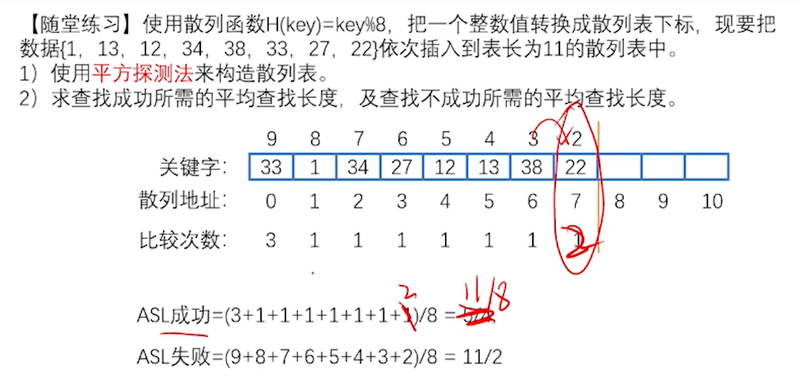
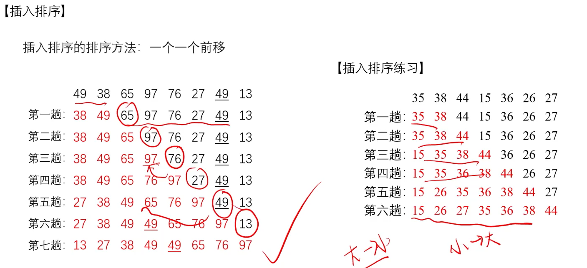
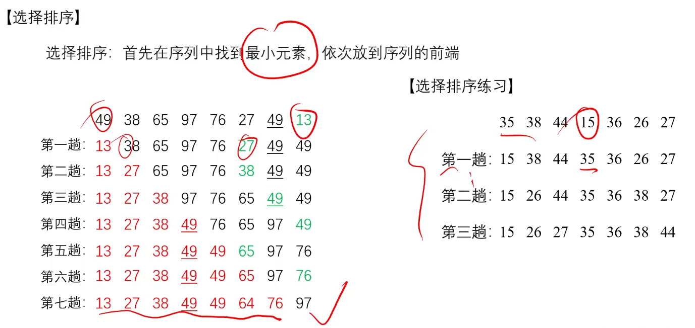
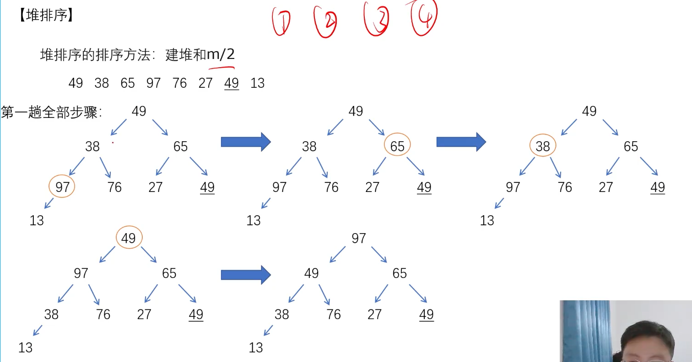
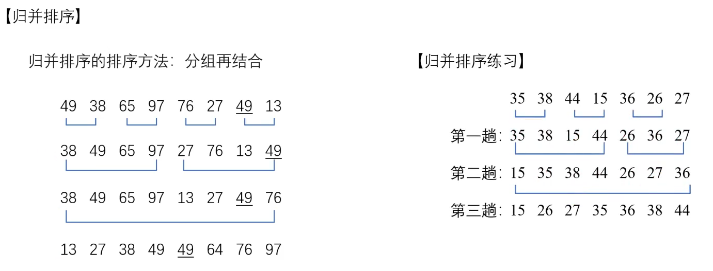

顺序表主要特点是随机访问，存储密度高，逻辑相邻的元素物理结构上也相邻，插入删除需要移动大量的元素

## 队列

**队列的存储结构**

```C++
define MaxSize
    typedef struct{
        Elemtype data[MaxSize];
        int front;	//队头指针：指向队头元素
        int reat;	//队尾指针：指向队尾元素的下一个位置
    }SqQueue
    
```

**循环队列判空和判满**：

​	顺序存储

> 初始状态：front == rear
> 队首指针进 1 ：front = ( front + 1 ) % MaxSize
> 队尾指针进 1 ：rear = ( rear + 1 ) % MaxSize
> 队列长度：（ rear - front + MaxSize ) % MaxSize
> 判空：front == rear
> 判满：( rear + 1 ) % MaxSize == front

​	链式存储

> 判空：front == rear
> 判满：front == reat -> next

## 栈的应用

计算表达式

表达式求值

## 稀疏矩阵

​	仅存储非零元素，构成三元组（行标、列标、值）

## KMP算法？

# 树与二叉树

​	节点数 = 总度数 + 1

## 卡特兰数

n 个元素进栈，出栈顺序不同的个数
n 个节点的二叉树有多少种

$\frac{1}{n+1} C_{2n}^{n}$

## 特殊的二叉树

**满二叉树**

1. 只有度为 2 的节点

2. 对每一个节点编号，双亲节点为 $\left \lfloor i{\div} 2 \right \rfloor $

3. 左孩子为 $2\times i$ ，右孩子为 $2\times i+  1$

**完全二叉树**

1. 只有一个度为 1 的节点

2. 若 $i\le \left \lfloor i{\div} 2 \right \rfloor$ 则 i 节点为分支节点，否则为叶子节点

3. 当节点数为奇数时，每个节点都有左右孩子节点

**二叉排序树**

1. 左子树上的所有关键字都**小**于根节点的关键字

2. 右子树上的所有关键字都**大**于根节点的关键字

**平衡二叉树（AVL树）**

1. 左子树和右子树的深度之差小于 1

**二叉树的性质**

1. 度为 0 的节点 = 度为 2 的节点 + 1

2. 非空二叉树上面至多有 $2^{k-1} $ 个结点

3. 高度为 h 的二叉树至多有 $2^{h}-1 $ 个结点，至少有h个结点

4. 从上往下，从左往右依次编号，i 节点所在的层次(深度)为 $\left \lfloor \log_{2}{i}  \right \rfloor +  1$

5. 具有 n 个结点的完全二叉树的高度为 $\left \lceil \log_{2}{(n+1)}  \right \rceil $

**二叉树的存储结构**

​	顺序存储就是将每个分量都存储在数组当中，用 0 来填充没有的节点

链式存储

```C
typedef struct biNode{
    ElemType date;	//数据域
	struct BiTNode *lchild;	//左孩子 
	struct BiTNode *rchild;	//右孩子
}
```

## 二叉树遍历

### 先序遍历

```C
//中左右
void PreOrder(BiTree T){
    if(t != null){
        visit(t);	//访问根节点
        PreOrder(t->lchild);	//遍历左子树
        PreOrder(t->rchild);	//遍历右子树
    }
}
```

### 中序遍历

```C
//左中右
void PreOrder(BiTree T){
    if(t != null){
        PreOrder(t->lchild);	//遍历左子树
        visit(t);	//访问根节点
        PreOrder(t->rchild);	//遍历右子树
    }
}
```

### 后序遍历

```C
//左右中
void PreOrder(BiTree T){
    if(t != null){        
        PreOrder(t->lchild);	//遍历左子树
        PreOrder(t->rchild);	//遍历右子树
        visit(t);	//访问根节点
    }
}
```

## 由遍历序列构造二叉树

### 由先序和中序确定

​	在先序遍历序列中。第一个节点一定是二叉树的根结点。在中序遍历中根节点必将中序序列分割成两个子序列。前一个子序列是根节点的左子数的中序序列，后一个子序列是根结点的右子数的中序序列。

### 由后序和中序确定二叉树。

​	后续序列的最后一个节点，可将中序序列分割成两个子序列。

**注**：先序和后序不能构成二叉树

## 线索二叉树

​	建立线索二叉树，或者说对二叉树进行线索化，实质上就是遍历二叉树的过程中，将二叉链表中的空指针改为指向前驱或后继的线索

## 树、森林与二叉树之间的转换

### 树转二叉树

> 树对应的二叉树没有右子树

1. 左右相邻的连线

2. 保留与第一个孩子的连线，删除与其他孩子的连线

3. 以根节点为轴心，顺时针旋转45°

### 森林转二叉树

1. 将树转为二叉树

2. 第一棵树不动，从第二棵树开始依次把后一棵二叉树的根节点作为前一棵树的右孩子

## 二叉树转森林

> 二叉树转为树或森林是唯一的

1. 若某节点是某双亲的左孩子，则把该节点的右孩子，右孩子的右孩子……都链接起来

2. 删除原二叉树中所有的双亲节点与右孩子节点的连线。

## 哈夫曼树

最小带权路径长度的二叉树

### 构造哈夫曼树

1. 将这N个结点分别作为N棵树仅含一个结点的二叉树，构成森林F。

2. 从F中选取两棵根结点权值最小的树作为新节点的左、右子树，并且将新节点的权值置为左、右子树上根结点的权值之和。

3. 从F中删除刚才选出的两棵树，同时将新得到的树加入F中。

4. 重复步骤2和3，直至F中只剩下一棵树为止。

## 并查集

> 该节点的值为父节点在数组中的位置


### 查找

​	返回该节点所在单元的根节点  //根节点的值为 -1

​	通过 for 循环一直查找父节点，知道 arr[ i ] =  -1;

# 图

​	图不可以是空图

**简单图**：不存在重复边，不存在顶点到自身的边

**完全图**

1. 具有 n 个顶点， n ( n - 1) / 2 条边的无向图，称为**完全无向图**

2. 具有 n 个顶点， n ( n - 1) 条边的有无向图，称为**完全有向图**

   一个图有 n 个顶点，如果边小于 n - 1 ，那么这个图必是非连通图

   强连通图最少要 n 条边

   无向图的全部顶点的度的和等于边数的 2 倍

   有向图的全部顶点的入度的和与出度的和相等，并且等于边数

   若一个图有 n 个顶点，并且边大于 n - 1 条，则此图一定有环

   顶点不重复出现的路径称为简单**路径**，除第一个顶点和最后一个顶点外，其余顶点不重复出现的回路称为**简单回路**

   一个顶点入度为0、其余顶点入度均为 1 的有向图称为**有向树**

## 图的存储及基本操作

### 邻接矩阵法

将图中的每个节点编号，并创建一个二维数组，将不同节点的编号当作数组的两个下标，

**邻接矩阵法特点**

1. 无向图的邻接矩阵一定是一个对阵矩阵（并且唯一）

2. 无向图的第 i 行/列的非零元素的个数正好是顶点 i 的度

3. 有向图的第 i 行的非零元素的个数正好是顶点 i 的出度

4. 无向图的第 i 列的非零元素的个数正好是顶点 i 的出度

5. 稠密图适合用邻接矩阵存储表示

### 邻接表法

​	在无向图中，选中一个节点作为链表头节点，后面依次跟上该节点所链接的节点

​	在有向图中，选中一个节点作为链表头节点，后面依次跟上该节点出度指向的节点

**邻接表法特点**

1. 稀疏图采用邻接表能节省存储空间

### 十字链表

​	是有向图的一种链式存储结构，

## 图的遍历

**广度优先搜索** (BFS) 类似于二叉树的层次遍历算法，需要借助队列实现

**深度优先搜索** (DFS) 类似于树的线序遍历，是一种递归算法，需要借助栈实现

​	邻接矩阵的遍历所得到的 DFS 序列和 BFS 序列是唯一的，邻接表的遍历所得到的 DFS序列和 BFS 序列不是唯一的，所以生成树也不是唯一的

**遍历性能分析**

对于 n 个顶点、e条边的图

1. **邻接表**表示时，**DFS**的时间复杂度为 O(n + e)，空间复杂度为 O(n)

2. **邻接表**表示时，**BFS**的时间复杂度为 O(n + e)，空间复杂度为 O(n)

3. **邻接矩阵**表示时，**DFS**的时间复杂度为$O(n^{2})$，空间复杂度为 O(n)

4. **邻接矩阵**表示时，**BFS**的时间复杂度为$O(n^{2})$，空间复杂度为 O(n)

## 图的应用

### 最小生成树

一个连通图的生成树包含图的所有顶点，只包含尽可能少的边，若减去一条边就会贬称非连通图，增加一条边必出现回路

**性质**

1. 最小生成树不唯一，当各边的权值不相等时，最小生成树唯一

2. 最小生成树的边的权值时唯一的

3. 最小生成树的边数为顶点数减 1

#### Prim算法构造最小生成树

​	适合用于稠密的图

​	从图中选则一个顶点加入树 T，之后选择一个与当前 T 中顶点集合最近的顶点，并将该顶点和对应的边加入 T ，每次操作后 T 中的顶点数和边数都加一，以此类推，直到图中所有顶点都并入了树 T

#### Kruskal算法

​	适用于边稀疏而顶点较多的图，是一种按权值的递增次序选择合适的边构造最小生成树，采用堆来存放边的集合

​	不断选取当前未被选取且权值最小的边，若这个边的顶点落在不同的连通分量上，则保留这个边，否则选取下一个

### 最短路径

​	把带权路径长度最短的那条路径称为最短路径

Floyd算法求任意两点之间的最短路径

#### Dijkstra算法

​	求一个顶点到其余各顶点的最短路径算法，路径权值不能为负数，基于贪心策略

​	使用邻接矩阵 / 邻接表表示时，时间复杂度为$O(n^{2})$

​	*路径为负数要用 Bellman-Ford算法*

1. 每次从未标记的节点中选择距离出发点最近的节点，标记，收录到最优路径集合中，

2. 计算刚加入节点 A 的邻近节点 B 的距离（不包含标记的节点）

3. 若（节点 A 的距离 + 节点 A 到节点 B 的边长）< 节点 B 的距离，就更新节点 B 的距离和前面点

#### Floyd算法

​	求任意两点之间的最短路径

​	时间复杂度为 $O(\left | n \right |^{3} )$

​	允许路径为负数，但不允许负数路径形成回路

**拓扑排序**：由一个无环图的顶点组成的序列

**AOE 网**：用边表示活动的网络，

**AOV 网和 AOE 网的区别**：都是有向无环图，但是边和顶点所代表的含义时不同的，AOE 网中的边有权值， AOV 网中的边无权值，仅代表顶点之间的前后关系

**关键路径：具有最大路径长度的路径，这条路径上的活动称为关键活动** [求关键路径](https://www.bilibili.com/video/BV1EQ4y1v7iV/?spm_id_from=333.337.search-card.all.click&vd_source=23f5ed0d3c1834be9c65f605933473c0)

[快速求关键路径](https://www.bilibili.com/video/BV1Fq4y1X7Tb/?spm_id_from=333.337.search-card.all.click&vd_source=23f5ed0d3c1834be9c65f605933473c0)

**事件最早发生时间**：从前往后，多路径的最大值

**事件最迟发生时间**：从后往前

**活动最早开始时间**：指这条弧的起点所表示的事件的最早发生事件

**活动最迟开始时间**：指这条弧的终点所表示的事件的最迟发生事件与该活动所需时间之差

**时间余量**：为 0 的节点链接起来为关键路径

> 关键路径上的所有活动都是关键活动，它是**决定整个工程的关键因素**。

对于有几条关键路径的网，只提高一条关键路径上的关键活动速度并不能缩短整个工程的工期，只有加快那些包含在所有关键路径上的关键活动，才能达到缩短工期的目的。

# 查找

## 顺序查找和折半查找

**静态查找表**：查找指定元素或查找满足某个条件的元素，查找方法有顺序查找，折半查找，散列查找

**动态查找表**：需要动态的插入或删除，查找方法有二叉排序树的查找，散列查找

**平均查找长度**：平均查找长度时所有查找过程中进行关键字的比较次数的平均值

> 当每个元素的查找概率相等，查找成功的平均长度为 $\frac{n+1}{2} $

**折半查找**：又称二分查找，仅适用于有序的顺序存储的顺序表，

> 当每个元素的查找概率相等，查找成功的平均长度为 $\log_{2}{(n+1)}-1 $
> 时间复杂度为 $O(\log_{2}{(n+1)})$

```C++
public static main(){
    int left = 0,right = L.length - 1,mid;
    
    while(left < hight){
        
        mid = (left + right) / 2;	//设定中间值
        
        if(L.item[mid] == key)	//判断是否为查找值，如果是则返回该值
            return L.item[mid];
        else if(L.item[mid] > key)
            right = mid -1;		//改变右边界
        else
            left = mid +1;	//改变左边界
        
    }
    return -1;	//查找失败
}
```


**分块查找**：块内元素可以无须，但块之间时有序的，第一个块中的最大关键字小于第二个块中所有的关键字以此类推

> **效率分析**
> 长度为 n ，有 b 块，每块有 s 个记录采用顺序查找则平均查找长度为$\frac{b+1}{2}+\frac{s+1}{2}=\frac{s^{2}+2s+n}{2s}$
> 采用折半查找则平均查找长度为$\left \lceil \log_{2}{\left (  b+1\right ) }  \right \rceil +\frac{s+1}{2} $
> 若 $s=\sqrt{n}$ 则平均查找长度取最小值 $\sqrt{n}+1$

## 树形查找

### 二叉排序树：

左子树节点值 < 根节点 < 右子树

**二叉排序树查找**：

```C
while(T != null && T->date != key){
    if(T->data > key)
        T = T->LChild;
    else
        T = T->RChild;
}
```


> **效率分析**
> *平衡二叉树* 平均查找长度为$O(\log_{2}{n})$
> 非平衡二叉树平均查找长度为将$(所在层数\times 该层节点个数)$相加，再除以总节点个数

**二叉排序树删除**：

1. 直接删除这个节点

2. 右子树空，用左子女填补

3. 左子树空，用右子女填补

4. 左右子树都不为空，在右子树上找中序第一个子女填补

在执行插入和删除操作时，二叉排序树的平均执行时间为$O(\log_{2}{n})$，二分查找的平均执行时间为$O(n)$

### 红黑树

是一个满足如下性质的二叉排序树

1. 每个节点时黑色或红色

2. 根节点为黑色

3. 叶节点（虚构的外部节点、null节点）为黑色

4. 不存在两个相邻的红节点（即红节点的父节点和孩子节点都是黑色）

5. 对每个节点，从该节点到任一叶节点的简单路径上，所含黑节点的数量相同

**结论**

- 从根到叶节点的最长路径不大于最短路径的 2 倍

- 有 n 个内部节点的红黑叔的高度 $h\le 2\log_{2}{(n+1)} $

- 新插入的节点初始为红色

### B树（多路平衡查找树）

**[B树讲解](https://www.bilibili.com/video/BV1HU4y1b76t?p=15&spm_id_from=pageDriver&vd_source=23f5ed0d3c1834be9c65f605933473c0)**

一棵m阶B树或为空树，或为满足如下特性的 m 叉树:

1. 树中每个结点至多有m棵子树(即至多含有 m - 1 个关键字)。

2. 若根结点不是终端结点，则至少有两棵子树。

3. 除根结点外的所有非叶结点至少有 $\left \lceil m{\div} 2 \right \rceil $ 棵子树(即至少含有 $\left \lceil m{\div} 2 \right \rceil - 1$ 个关键字)。

4. 所有的叶结点都出现在同一层次上，并且不带信息

### B+树

1. 每个分支节点最多有 m 棵子树（孩子节点）

2. 除根结点外的所有非叶结点至少有 $\left \lceil m{\div} 2 \right \rceil $ 棵子树

3. 结点的子树个数与关键字个数相等

#### B 树和 B+ 树的主要差异

1. 同样有 n 个关键字，但是 B 树中的关键字比 B+ 树多 1

2. B+ 树中非叶节点的关键字仅起到索引作用，*该关键字为子节点中的最大值或最小值*

3. B+ 树中叶节点包含了全部关键字，B 树中叶节点包含的关键字和其他节点的关键字时不同的

## 散列表

**散列函数**：一个可以把查找表中的关键字映射成该关键字对应的地址的函数

**散列表**：根据关键字直接进行访问的数据结构

*理想情况下对散列表查找的时间复杂度为 O(1)*

**常用的散列函数**：

1. 直接定址法：$H= a\times k+  b$

2. 除留余数法：$H= k \% p$

### 处理冲突的方法

#### 线性探测法


#### 平方探测法



#### 拉链法

散列表的查找效取决于：散列函数、处理冲突的方法、装填因子

装填因子：一般为 （表中记录数）/（散列表长度）

- 平均查找长度依赖于散列表的装填因子

- 装填因子越大，装填的记录越满，发生冲的可能性就越大

# 排序

**算法稳定性**：如果两一些相同的元素 x、y、z 进行排序后顺序保持不变，即还是x、y、z 则这个算法就是稳定的

**内部排序**：排序期间将所有元素都放入内存当中的排序

**外部排序**：排序期间将所有元素无法全部放入内存当中的排序

## 排序算法

| 排序方法 | 时间复杂度—最好   | 时间复杂度—最坏   | 时间复杂度—平均   | 空间复杂度        | 稳定性 |
| -------- | ----------------- | ----------------- | ----------------- | ----------------- | ------ |
| 插入排序 | $O(n)$            | $O(n^{2} )$       | $O(n^{2} )$       | $O(1)$            | 稳定   |
| 希尔排序 | $O(n)$            | $O(n^{2} )$       | $O(n^{1.3} )$     | $O(1)$            | 不稳定 |
| 冒泡     | $O(n)$            | $O(n^{2} )$       | $O(n^{2} )$       | $O(1)$            | 稳定   |
| 选择排序 | $O(n^{2} )$       | $O(n^{2} )$       | $O(n^{2} )$       | $O(1)$            | 不稳定 |
| 快速     | $O(n\log_{2}{n})$ | $O(n^{2} )$       | $O(n\log_{2}{n})$ | $O(n\log_{2}{n})$ | 不稳定 |
| 堆排序   | $O(n\log_{2}{n})$ | $O(n\log_{2}{n})$ | $O(n\log_{2}{n})$ | $O(1)$            | 不稳定 |
| 归并     | $O(n\log_{2}{n})$ | $O(n\log_{2}{n})$ | $O(n\log_{2}{n})$ | $O(n)$            | 稳定   |
|          |                   |                   |                   |                   |        |
| 桶       | $O(n)$            | $O(n^{2} )$       | $O(n+k)$          | $O(n+k)$          | 稳定   |
| 计数     | $O(n+k)$          | $O(n+k)$          | $O(n+k)$          | $O(n+k)$          | 稳定   |
| 基数     | $O(n×k)$          | $O(n×k)$          | $O(n+k)$          | $O(n+k)$          | 稳定   |

记忆技巧：

1. 稳定性**：快希(些)** **选**一**堆**好友来聊天

2. 时间快**：快希(些)归**队

### 直接插入排序

算法执行步骤：选则后面的无序序列中的第一个值，将他插入到前面的有序序列中的合适位置

```C
//代码辅助理解，不用记
int i,j;
for(i = 2; i < n; i++){
    if(L[i] < L[i-1]){
        L[0] = L[i];        
        for(j = i - 1; L[0] < L[j]; j--){
            L[j+1] = L[j];
        }
        L[j+1] = L[0];
    }
}
```



### 希尔排序

算法执行步骤：

```C
for(dk=n/2;dk>=1;dk=dk/2){
    for(i=dk+1;i<=n;i++){
        if(L[i]<A[i-dk]){
            L[0]=L[i];
            for(j=i-dk;j>0&&L[0]<L[j];j-=k){
                L[j+dk]=L[j];
            }
                L[j+dk]=L[0];
        }
    }
}
```

### 冒泡排序


### 快速排序


### 选择排序




### 堆排序



### 归并排序



### 基数排序


