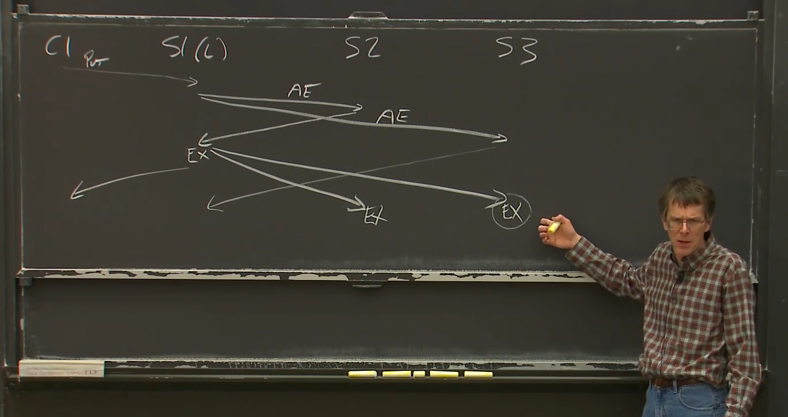
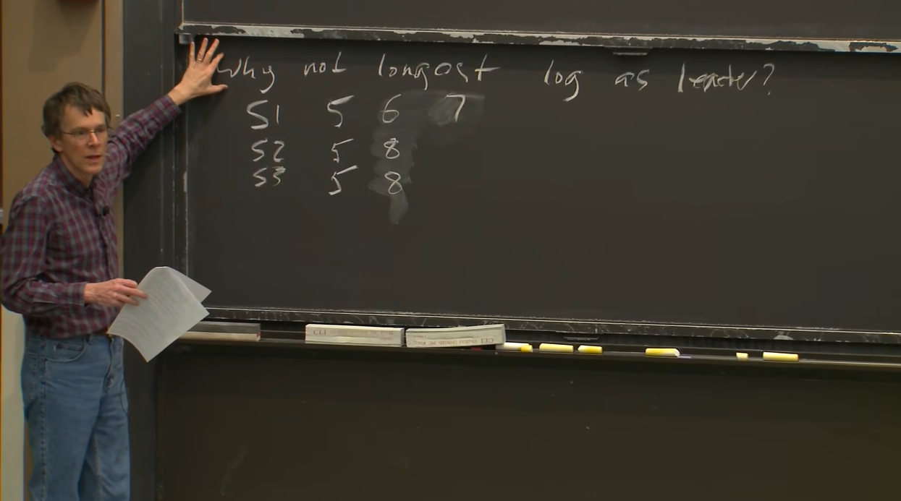

多台计算机进行协作，完成同一项任务，在设计一个系统时，先考虑是否可以在单机上面运行，如果可以，那么就应该在单机上面解决，在考虑一个问题时，需要知道他是否可以在不需要分布式系统的单机上解决，使用单机解决问题通常比分布式系统简单很多，分布式系统会让问题变的复杂。

在设计分布式系统时，可以分为三个方面，存储、通信、计算。

分布式系统更高的目标是具有可扩展的速度提升，2 × 计算资源数量，可以得到两倍的性能或吞吐量提升。

当有 1 亿个 用户同时访问一个 web 服务时，单机是肯定扛不住的，这时就需要增加 web 服务器，但是 web 服务器也不是可以无限增加的，如果增加了 100 台 web 服务器，访问的都是同一个 DB 服务器，这时再增加 web 服务器提升的性能就很小，如果还要提升性能，就需要增加 DB 服务器。

我们把一个很罕见的错误转变成一个在一千台的分布式系统中常见的错误，甚至在这个集群中一直在发生的错误。一台机器可以稳定运行很长时间，但是一千台机器同时运行，那么每天总会有某台机器出现故障，各个地方总会出现一些小问题，比如散热风扇不转，有人把网线踩掉。这意味着在分布式系统的扩容，需要把一个很小的问题变成一个持续不断的问题。意味着对于错误而言，正确回复或者掩盖错误，以及继续处理的能力必须要在架构设计时就建立，因为错误总会发生。

**容错** 

1. 可用性：经过精心设计，在某个特定的错误场景下还能提供完整的服务，某些系统建立了冗余的服务，比如做了两个备份，即便一个备份发生问题，可能另一个还能提供服务，因此可用性是建立在特定的错误类型上的。
2. 自身的可恢复性：如果出现问题，会停止工作，等被人修复之后，如果没有发生更糟糕的问题，系统可以继续正常运行，比可用性弱一些，在故障被修复之前，他是不会做任何事情，这一切是建立在没有损失正确性的前提下。

**容错解决工具**中一个是**非易失性存储**，但是代价是很大的，第一是需要摆动磁盘臂，等待磁盘盘面旋转，即便现在闪存的性能很高，但是还会遇到很多性能不够的情况。另一个是**复制**，两台系统本应该有同样的副本，但是这两个副本总是会有意外的，偏离同步状态，不再正确。

**一致性：**

1. 强一致性：保证所有的 Get 操作读到最新的数据。*需要更昂贵的通信*
2. 弱一致性：不保证所有的 Get 操作读到最新的数据。

## MapReduce模型

主要思想是将大的任务拆分成小的任务，分发到不同的机器上进行并行计算。

大致可以分为 **Map**、**Shuffle**、**Reduce** 三个过程。

**Map**：根据任务量大小分为多个 Map ，每个 Map 任务会读取源数据，会最终生成一个 `< K , v >` 键值对，然后根据 K 计算所属分区，并生成一个逻辑标识 P ，表示应该应该去到的 Reduce。

**Shuffle**：过程包含在 Map 端和 Reduce 端， Map 端的 Shuffle 会对数据进行一个排序，得到一个有序的文件，该文件按照分区排序，并且每个分区的键值对都按照 K 的值进行升序排序， Reduce 端的 Shuffle 拉取属于自己分区的数据，并进行一个合并排序。

**Reduce**：根据业务需求对数据处理，并输出结果。

## Big Storage
分布式存储主要包括**并行性能**、**容错**、**复制**、**一致性**。
### 难点
将数据分片到各个服务器上，可以并行的从多台服务器读取，提升性能。这样会导致错误的增加，每天每小时都会有服务器宕机，所以需要一个自动化的**容错系统**。

### 容错系统
**复制**：有两个或者三个副本，需要考虑数据一致性，会损失性能。**数据一致性也要保证操作一致性**
   > 两台数据服务器，如果同时有多个请求，要保证处理这些请求的顺序也是相同的。  
   > 强一致性的性能代价是很大的，基本上都考虑弱一致性，把一致性控制在合理的范围之内

## GFS_分布式文件系统设计（Google）

为大型顺序文件读写以多种方式定制的，只处理大型文件的顺序访问，而不是随机访问，用性能换一致性，用复制换稳定。

**Master节点**：
存储从文件名到数据存储位置的映射，并管理命名和追踪 chunk 的位置

**ChunkServer节点**：
块服务器，存储实际的数据，每个 Chunk 是固定大小（64MB）

每个 Primary 节点有一个租约时间，这个租约时间是由 Master 发放的。 

Master 存储了两张表
1. FileName 到 Chunk 的映射：  
   记录每个文件路径（如 /data/log.txt）对应的一组 Chunk ID，体现整个文件系统的命名空间和逻辑结构。
2. Chunk ID 到元数据的映射：  
   其中有一项是 Chunk Server 的列表，这些 Chunk Server 保存数据的副本。另一项为 Chunk 的版本号，对于 Chunk 的读写操作必须在 Chunk Primary —— 主节点上顺序化，

在 Master 节点中，读取数据从内存中读，写操作都需要保证写入磁盘，任何数据变更都会在磁盘的日志追加一条，并定期创建 CheckPoint
> Chunk Server 列表不会保存在磁盘上，Master 重启后会询问 Chunk Server都存储了哪些 Chunk

当 Master 创建了一个新的 Chunk 或者新的 Primary 被指派导致版本号发生改变时 Master 都必须追加一点记录到日志中，内容为 添加了一个新的 Chunk 或修改了版本号

某些时候会额外创建一份状态快照到磁盘。当重启的时候会回到最近的 CheckPoint 的位置，重演 CheckPoint 之后的日志就可以

### Read操作
1. 客户机请求 Master 节点
2. Master 查表，获取多个 ChunkServer的位置
3. 客户机选一个 ChunkServer 根据延迟或就近挑选一个副本脸上
4. 发送请求给 ChunkServer ，包含 chunk ID + 读取偏移 + 长度。

> **Q:**  如果读取的文件刚好是两个 chunkserver的头部和尾部怎么办，这一段刚好跨了 chunk A 的尾巴 + chunk B 的开头  
> **A:**  分两段读取，Master 会返回 Chunk ID 列表和每个 Chunk 副本的位置，然后客户端识别出跨 Chunk ，最后分别发起两个读取请求，一个读 Chunk A 的尾部，另一个请求读 Chunk B 的头部，然后由客户端拼接返回。

### Write操作
1. 客户机请求 Master 节点，获取到 Chunk 位置和当前 Primary ，如果没有 Primary ，会选一个并签发租约
2. 客户机按照流水线的方式 Push 到所有的副本，这时还没有写入磁盘，这是缓存在内存中
3. 客户机发起写请求给 Primary 
4. Primary 发出写命令给其他副本，带上操作序号
5. 所有副本收到后，按顺序写入磁盘
6. 副本写入之后，按顺序写入磁盘
7. 所有副本写完之后，Primary 收集确认，并回复客户机成功

> **脑裂**： 指原本应该协同工作的多个节点（如服务器、存储节点、网络设备等）由于通信中断，导致彼此无法感知对方的状态，从而分裂成多个独立运行的子集群，每个子集群都认为自己是“唯一存活”的，进而可能导致数据不一致、服务冲突甚至系统崩溃。

在这个系统中，如果对文件由顺序需求，应该尽可能的避免多个 Client 并发的写入文件，

**在这个系统中，强一致性需要考虑的问题**
1) Primary 检测重复的请求，保证幂等性。
2) 如果 Primary 告诉 Secondary 做什么事情，那么， Secondary 就必须真的执行，而不是只返回错误。如果 Secondary 出现错误，需要及时踢出去，保证其他的可以使用。
3) 当 Primary 要求 Secondary 追加时，Secondary 必须小心不将数据暴露给请求者，直到 Primary 确信Secondary 能够执行追加操作为止。
   > **两段式提交**  
   > 可以将这个操作分为多个阶段  
   > Primary 请求 Secondeay
   > Primary 确定所有的 Secondeay 都可以执行操作  
   > Primary 发出执行操作命令
   

## 主/备复制

复制是否值得，取决于应该有多少副本，愿意花多少钱，以及关于失败之后会带来多少损失

**State Transfer（状态转移）**
主机定期将完整状态复制给备份，备份只保存最新状态，用于主机宕机时接管。

**Replicated State（状态复制）**
主机只传输 Client 的操作顺序，副本按照操作顺序一步步执行相同的命令，达到相同的状态

*状态复制过程*  
1. Client 向 Primary 发起操作请求。
2. Primary 将请求封装为一条日志，并加上编号，然后把这条日志广播给副本节点。  
3. 副本节点把这条日志追加到本地日志中，仅写入，不执行，然后向主节点返回 ACK 。  
4. Primary 收到多数副本的确认（通常是 N/2 +1）之后，认为日志可以提交， Primary执行日志，并更新状态机，然后通知所有副本可以执行日志。  
5. 副本按照顺序执行日志，并更新状态机。

论文中提到，在 Primary 和 Backup 两个VM-FT以外，假设还通过网络和外部一个 Storage 存储保持通讯。外部 Storage 通过一个 flag 记录 Primary 和 Backup 状态，记录谁是 Primary 等信息。

当 Primary 和 Backup 之间发生网络分区问题，而 Primary 、 Backup 仍可以与这个外部 Storage 通信时， Primary 和 Backup 互相会认为对方宕机了，都想把自己当作新的 Primary 为外界的 Client 提供服务。此时，原 Primary 和原 Backup 都试图通过 test-and-set 原子操作在外部 Storage 修改flag记录（比如由0改成1之类的），谁先完成修改修改，谁就被外部 Storage 认定为新的 Primary ；而后来者 test-and-set 操作会返回1( test-and-set 会返回旧值，这里返回1而不是0，表示已经有人领先自己把0改成1了)，其得知自己是后来者，会主动放弃称为 Primary 的机会，在论文中提到会选择终结自己 (terminate itself)。

> Q：为什么 Client 不需要发送数据到 Backup  
> 
> A：因为这里Client发送的请求是具有确定性的操作，只需向 Primary 请求就够了。主备复制机制保证 Primary能够将具有确定性的操作正确同步到其他Backup，即系统内部自动保证了 Primary 和 Backup 之间的一致性，不需要 Client 额外干预。接下来的问题即，怎么确定一个操作是否具有确定性？在复制状态机(replicated state machine，RSM)方案中，即要求所有的操作都是具有确定性的，不允许存在非确定性的操作。
>
> Q: 是不是存在着混合的机制，即混用状态转移(state transfer)和复制状态机(replicated state machine，RSM)？
> 
> A: 是的。比如有的混合机制在默认情况下以复制状态机(replicated state machine，RSM)方案工作，而当集群内 Primary 或 Backup 故障，为此创建一个新的 replica 时则采用状态转移(state transfer)转移/复制现有副本的状态。

**备份启动过程**
1) 判断 Primary 是否宕机，一般通过心跳机制、超时判断、 Raft 判断  
2) 选出新的 Primary 通过设置好的优先级、或共识协议选出新的 Primary ，但可能会包含多个副本，选取版本最新的哪一个，如果发现自己缺数据，可以等待其他副本补齐或者主动发起同步  
3) 接管服务，如果原主节点恢复，会变成新的备份。

## 容错 - RAFT

> [Raft 协议原理详解，10 分钟带你掌握！ - 知乎 (zhihu.com)](https://zhuanlan.zhihu.com/p/488916891) <= 图片很多，推荐阅读
> 
> [Raft 协议 - 简书 (jianshu.com)](https://www.jianshu.com/p/c9024d05887f) <= 有动图，还不错
>
> [Raft 协议动态演示](https://thesecretlivesofdata.com/raft/#home) <= 每个步骤都带动画讲解，非常 nice

Raft协议是分布式复制协议(distributed replication protocol)示例的核心组件之一。

大多数情况下，单点故障是可以接受的，因为单机故障率显著比多机出现一台故障的概率低，并且重启单机以恢复工作的成本也相对较低，只需要容忍一小段时间的重启恢复工作。

而上诉的方案中，采用单机管理而不是采用多实例/多机器的原因，是为了避免 **脑裂(Split-Brain)** 问题。

### 大多数原则

用于解决单点故障问题，同时也用于解决网络分区问题。这类解决方案的基本思想即：大多数原则(majority rule)，**简单理解就是少数服从多数**。

这里的 majority 指的是整个系统中无论机器的状态如何，只要获取到大于一半的赞成，则认为获取到majority 。

ps： 如果极端情况下所有分区都不占多数（ 比如这里3台被拆成1台、1台、1台的分区），那么整个系统都不能运行。

如果允许 f 台机器宕机，一般扩展到 2f + 1 台机器。

### 使用Raft构造复制状态机RSM

**系统工作大致流程**
1. Client 发送请求到 Leader ，随机连接集群中的一个节点，如果不是 Leader ，则返回 Leader 的地址，客户机重定向到 Leader。
2. Leader 收到请求并写入日志，并本地持久化。
3. Leader 广播日志给所有的 Followers ，Follower 收到之后会校验任期和日志连续性，通过校验持久化日志并向 Leader 返回成功。
4. Leader 等待 majority 确认，达成之后 Leader 提交日志，并标记为可执行。
5. Leader 执行操作，并将结果返回给 Client 。
6. 在下一次的 AppendEntries 中，会携带最新已提交的日志索引。

> Q： 为什么不是全部确认？  
> A： 需要保证整个系统运行，而不是因为某个机器宕机导致整个服务失效。
>
> Q： Follower 的 commit 在什么时候？  
> A： 在 RAFT 中不存在日志提交的消息，取而代之的是 leader 会在下一次的 AppendEntries 中，记录信息，不管是什么原因，像 leader commit 或者 leader 需要发送 heartbeat 或者 需要发送一条新的客户端请求的时候会把 leader 最新的 commit 值连带发送出去。

**日志的作用**
1. 维护操作顺序，这个操作顺序对于 Replicated State 非常重要。
2. 通过日志 Leader 可以安排请求操作的顺序，当产生并发的请求，Leader 就需要确定一个顺序，确保 Follower 也会执行到这个顺序。
3. 在没有收到 Leader 的 commit 号增长消息之前，Follower 还不能执行，必须把这条操作暂存起来，直到收到 Leader 的消息。
4. Leader使用日志的原因是，在部分 Follower 离线时，Leader 要有能力重新发送 Follower 错过的消息，第二个原因是如果一个 server 重新加入集群，就需要这些日志，server 重启之后，会对日志中的操作，从头进行重演。

> Q： 如果 Leader 每秒能处理 1000 条请求，而 Follower 每秒只能处理 100 个请求会怎么样？  
> A： Follower 需要确定，确认消息的速率是不受限制的，所以会产生 Follower 一秒一次确认 1000 条请求，将会导致日志大小没有上限，最终在某个时间点耗尽内存。

### Leader Election (选举)

*有 Leader vs 无 Leader*
- 有 leader：Client 只需要 发送一次请求就可以
- 无 leader：Client 需要发送请求两次，第一次和一个临时 Leader 达成一致，第二次发出实际请求。

RAFT 使用 term(任期) 号标识不同的 Leader

Follower 不需要知道 Leader 的标识，只需要知道当前 term 号

一个任期里可能有一个 Leader，也可能没有 Leader ，绝对不会出现两个 Leader

**创建 Leader** 

内部维护了一个定时器，如果选举周期到了之后还没有收到当前 Leader 的消息，server 就假设 Leader已经挂了，发起新一次的选举

先执行 Term ++ ， server 升级为 candidate 状态。
并强制发起新一轮选举，然后发送 RequestVotes RPC 给其他的所有 server ，会发送出 N-1 条， candidate 会先给自己投一票

需要考虑的特殊情况，比如产生了一个网络分区，旧的 leader 仍然存活，并处在一个只包含不到一半的 server 分区中，那么超过一半的 server 的分区可能会发生选举，并成功选取出一个新的 server ，但是新的 Leader 并不知道旧的 leader 的存在，需要考虑到旧的 leader 会干啥

**server 是怎么知道那个 server 被选举了**

发起选举的 candidate 胜出，则发送 AppendEntries 消息，告诉 其他的 server 我是 term n 号的 Leader ，除了 Leader 其他人是不允许发送 AppendEntries 消息的，这条消息会重置每个 server 的选举定时器，

**选取失败的情况**

有多个 server 之间会瓜分选票，加入有三台 server，当 Timer 同一时间触发，这些 server 先给自己投了一票，成为 candidate ，当接收到其他 server 发送过来的选票，因为先给自己投过一票就会回复 no ，现在每个 server 各自有一票，导致选取失败

**日志同步**

上任之后会发送第一条 AppendEntrie：里面有两个参数，PrevLogIndex —— 上一个 log 槽位的 index，PrevLogTerm —— 上一个槽位 Term 编号，nextIndex——当前所有 server 的 log 的 nextIndex。

Leader 为每个 Follower 维护了 nextIndex , nextIndex的初始值是从新任Leader的最后一条日志开始。

Leader 发送 AppendEntrie，server 收到之后检查本地的前一个 Log 条目，是否与 Leader 发来的有关前一条Log的信息匹配对比是否一致，不一致回复 false ，Leader 收到 false 之后 回退nextIndex ，并再次发送 nextIndex 。同时，这次Leader发送的AppendEntries消息包含了prevLogIndex之后的所有条目， server 检查为 true 之后将 nextIndex 之后的条目写入自己的 log 中，完成同步。

ps：如果接受一个 AppendEntries 消息，那么需要首先删除本地相应的 Log 。

日志快速恢复：让 Follower 返回足够的信息，让 Leader 以 Term 为单位来回退，

**为什么不选举日志条目最大的为 Leader**

有s1、s2、s3台服务器，s1 为 Leader ，当收到一个 client 请求，在发出 AppendEntries 之前将请求写入 log ，之后就宕机了，很快就重启了，在新的选举中，又被选为 leader ，在接受一个请求，写入 log 之后，发出 AppendEntries 之前又宕机了，重新选举 s2 为 leader ， 接收到一个请求，并完美的处理，处理完之后 s2 宕机，触发选举。

**选举机制**
候选人最后一条Log条目的任期号大于本地最后一条Log条目的任期号。
或者，候选人最后一条Log条目的任期号等于本地最后一条Log条目的任期号，且候选人的Log记录长度大于等于本地Log记录的长度。

**系统出现故障**
- Client 向 Leader 请求
- Leader 向其他2台机器同步 log 并且获得 ACK
- Leader 准备响应时突然宕机，无法响应 Client
- 其他2台机器重新选举出其中1台作为新的 Leader
- Client 请求超时或失败，重新发起请求，系统内部 failover 故障转移，所以这次 Client 请求到的是新 Leader
- 新 Leader 同样记录log并且同步log到另一台机器获取到ACK
- 新 Leader 响应 Client

持久化（Persistence）

目的一：让新服务器在集群内工作 目的二：集群断电之后能够快速恢复。

需要考虑的是存活的两台机器的log中会有重复请求，而我们需要能够检测(detect)出这些重复请求。

